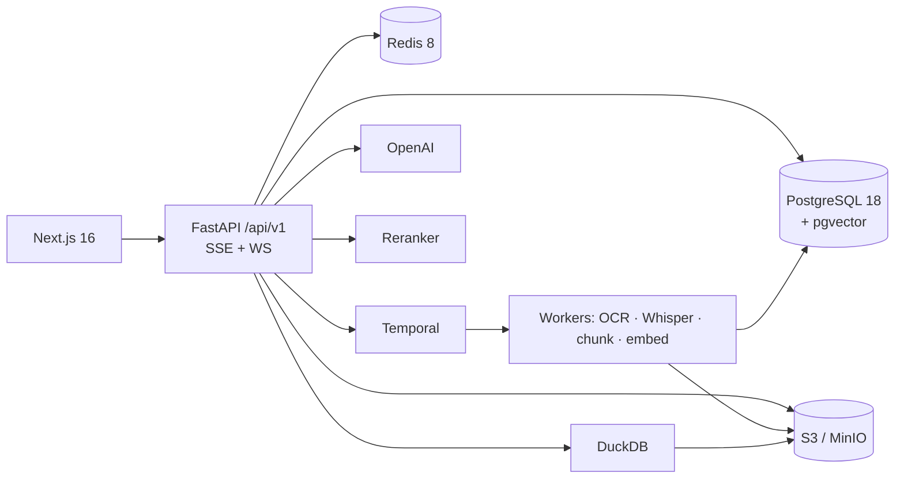

# 🏗️ Foundry

**An enterprise-grade, multimodal knowledge platform.**

Upload massive volumes of documents → process them asynchronously through durable
workflows → store semantic + tabular knowledge → **chat with your enterprise knowledge**
via agentic Retrieval-Augmented Generation.


---

## What is Foundry?

Organizations sit on large, mixed piles of documents — reports, decks, spreadsheets, contracts,
recorded calls — and need trustworthy answers and insights without reading everything or waiting
on an analyst. Foundry turns that document sprawl into a **conversational, cited, analytically
capable** knowledge base.

Users create **workspaces → projects → documents**. Every upload is ingested asynchronously
through **Temporal** workflows (OCR, transcription, parsing, chunking, embedding, indexing), then
made queryable through a **streaming, agentic chat** that both retrieves grounded passages and
runs **real analytics over spreadsheet data** — always with inline citations back to the exact
source (page / slide / timestamp).

It is built to resemble a real production SaaS — multi-tenancy, RBAC/ABAC, durable orchestration,
observability, and evaluation — not a demo.

## ✨ Key capabilities

- **Multi-tenant accounts** — Organization → Workspace → Project → Document, isolated by Postgres Row-Level Security.
- **Invite-based auth** — self-built JWT + rotating refresh tokens, email verification, password reset, **ABAC** authorization.
- **Multimodal ingestion** — PDF, DOCX, PPTX, XLSX, Markdown, images, audio, video (≤ 500 MB, direct-to-S3 multipart).
- **Durable pipelines** — Temporal **workflow-per-file-type** with shared activities, dedup + versioning, DLQ, partial resume, cancel/pause signals, and live progress.
- **Dual knowledge store** — pgvector (semantic) **+** DuckDB/Parquet (tabular analytics), all backed by a single PostgreSQL.
- **Agentic RAG chat** — streaming, tool-using (hybrid retrieval + text-to-SQL router), grounded inline citations, summarized memory.
- **Evaluation & observability** — LangSmith tracing + RAGAS-style CI evals; OpenTelemetry → Prometheus/Tempo/Loki/Grafana; audit logs.
- **Fully Dockerized** — `docker compose up` brings up the entire platform locally with seed data.


## 🧱 Tech stack

Versions are **pinned to the latest stable / LTS lines as of July 2026** (no beta/RC). Full matrix
in `[docs/02-tech-stack-and-versions.md](./docs/02-tech-stack-and-versions.md)`.


| Layer             | Technologies                                                                                                                                                              |
| ----------------- | ------------------------------------------------------------------------------------------------------------------------------------------------------------------------- |
| **Backend**       | Python 3.14 · FastAPI 0.139 · Temporal · SQLAlchemy 2.0 · Alembic · Pydantic v2 · Docker                                                                                  |
| **Data**          | PostgreSQL 18 · **pgvector 0.8.2 (extension, same DB)** · Redis 8 · DuckDB (1.4 LTS) + Parquet                                                                            |
| **AI**            | OpenAI Responses API + `text-embedding-3-small` (1536) · self-hosted GLM OCR · self-hosted Whisper · cross-encoder reranker · LangChain (where it adds value) · LangSmith |
| **Frontend**      | Next.js 16 (App Router, RSC) · React 19.2 · TypeScript 6 · Tailwind CSS 4 · TanStack Query 5 · Zustand 5 · nuqs · Node 24 LTS                                             |
| **Storage**       | AWS S3 (MinIO locally)                                                                                                                                                    |
| **Observability** | OpenTelemetry · Prometheus · Tempo · Loki · Grafana · GlitchTip                                                                                                           |
| **Deploy**        | Docker Compose (local) · GitHub Actions (CI/CD) · Vercel (frontend) · Render/AWS (backend)                                                                                |


> **State management note:** server state via TanStack Query, client/UI state via Zustand, URL
> state via nuqs, initial reads via React Server Components. Redux is intentionally not used.


## 🏛️ Architecture at a glance




Two knowledge paths, unified by the chat agent at query time:

1. **Unstructured** → chunks + embeddings in pgvector (hybrid vector + BM25 → rerank → RLS/metadata filters).
2. **Structured (XLSX)** → Parquet, queried by **DuckDB agentic text-to-SQL** (validated, read-only).


## 📚 Documentation

The complete engineering specification lives in `[/docs](./docs)` — 22 linked documents written to
be consumed by engineers **and** an autonomous coding agent. Start with the
[docs index & decision ledger](./docs/README.md).


| #   | Document                                                                       |
| --- | ------------------------------------------------------------------------------ |
| 00  | [Overview](./docs/00-overview.md)                                              |
| 01  | [Product Requirements (PRD)](./docs/01-prd.md)                                 |
| 02  | [Tech Stack & Pinned Versions](./docs/02-tech-stack-and-versions.md)           |
| 03  | [Functional Requirements](./docs/03-functional-requirements.md)                |
| 04  | [Non-Functional Requirements](./docs/04-non-functional-requirements.md)        |
| 05  | [User Stories & Acceptance Criteria](./docs/05-user-stories-and-acceptance.md) |
| 06  | [UX Flows](./docs/06-ux-flows.md)                                              |
| 07  | [Database Schema & ER Diagram](./docs/07-database-schema.md)                   |
| 08  | [Backend Architecture](./docs/08-backend-architecture.md)                      |
| 09  | [Frontend Architecture](./docs/09-frontend-architecture.md)                    |
| 10  | [API Specification & Contracts](./docs/10-api-specification.md)                |
| 11  | [Temporal Workflow Design](./docs/11-temporal-workflows.md)                    |
| 12  | [RAG & Analytics Pipeline](./docs/12-rag-and-analytics-pipeline.md)            |
| 13  | [Security Architecture](./docs/13-security-architecture.md)                    |
| 14  | [Deployment & Infrastructure](./docs/14-deployment-and-infrastructure.md)      |
| 15  | [Observability](./docs/15-observability.md)                                    |
| 16  | [Testing Strategy](./docs/16-testing-strategy.md)                              |
| 17  | [Diagrams](./docs/17-diagrams.md)                                              |
| 18  | [Risks & Trade-offs](./docs/18-risks-and-tradeoffs.md)                         |
| 19  | [Future Enhancements](./docs/19-future-enhancements.md)                        |
| 20  | [Roadmap & Milestones](./docs/20-roadmap-and-milestones.md)                    |


## 🚀 Getting started

> Implementation is spec-first; the repo scaffold is generated from `/docs`. Once code exists, the
> canonical local workflow is:

```bash
# 1. Configure environment
cp infra/.env.sample .env      # fill in OPENAI_API_KEY, secrets, etc.

# 2. Bring up the entire platform (API, workers, Postgres+pgvector, Redis,
#    Temporal, MinIO, model workers, observability)
docker compose up --build

# 3. Run migrations + seed demo data
docker compose run --rm migrate
docker compose run --rm seed

# App:        http://localhost:3000
# API docs:   http://localhost:8000/api/v1/docs
# Temporal UI: http://localhost:8080
# Grafana:    http://localhost:3001
```

See `[docs/14-deployment-and-infrastructure.md](./docs/14-deployment-and-infrastructure.md)` for the
full service list and environment configuration.

## 🗺️ Roadmap

Delivered in ordered, independently-demoable milestones (M0 → M7):
foundations → identity/tenancy → documents/upload → ingestion pipeline → retrieval/knowledge stores
→ agentic chat → admin/observability/eval → hardening & delivery. Details in
`[docs/20-roadmap-and-milestones.md](./docs/20-roadmap-and-milestones.md)`.

## 📌 Scope notes

- **In scope:** everything above — the full vision, built in milestones.
- **Deferred (schema-ready):** SSO/SAML, billing, real-time co-editing, native mobile, video visual
understanding. See [Future Enhancements](./docs/19-future-enhancements.md).

---

Foundry — a flagship demonstration of full-stack AI systems architecture.