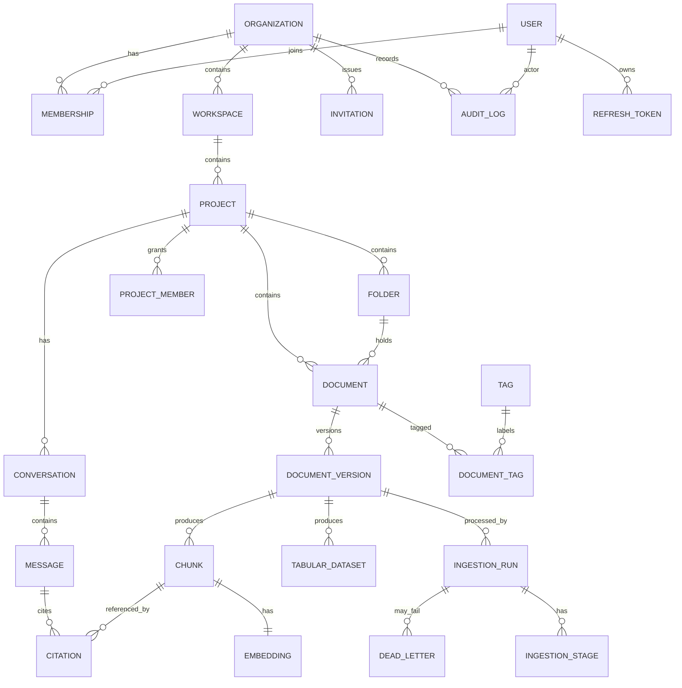

# 07 — Database Schema & ER Diagram

**One PostgreSQL 18 database** holds everything: relational data, full-text search, and vector
embeddings. **pgvector 0.8.2 is a Postgres extension in this same database** — there is no
separate vector store. Tabular spreadsheet data is additionally materialized as Parquet on
object storage and queried by DuckDB (see [12](./12-rag-and-analytics-pipeline.md)); Postgres
holds the catalog/metadata for those Parquet datasets.

## Conventions
- Primary keys: `uuid` (v7 preferred for time-ordering) named `id`.
- Every tenant table has `organization_id uuid NOT NULL` and an RLS policy.
- Timestamps: `created_at`, `updated_at` (`timestamptz`, default `now()`); soft-delete via `deleted_at`.
- Enums implemented as Postgres `ENUM` types (or `text` + check) — listed per table.
- All FKs indexed; composite indexes on `(organization_id, <hot column>)`.

## Extensions
```sql
CREATE EXTENSION IF NOT EXISTS "uuid-ossp";
CREATE EXTENSION IF NOT EXISTS "pgcrypto";
CREATE EXTENSION IF NOT EXISTS vector;      -- pgvector 0.8.2
CREATE EXTENSION IF NOT EXISTS pg_trgm;     -- trigram fuzzy search
-- Full-text uses built-in tsvector; BM25-style ranking via ts_rank_cd.
```

## ER diagram



## Core tables (DDL sketch)

### Identity & tenancy
```sql
CREATE TABLE users (
  id              uuid PRIMARY KEY DEFAULT gen_random_uuid(),
  email           citext UNIQUE NOT NULL,
  password_hash   text,                      -- Argon2id; null until invite accepted
  full_name       text,
  is_superuser    boolean NOT NULL DEFAULT false,
  email_verified_at timestamptz,
  created_at      timestamptz NOT NULL DEFAULT now(),
  updated_at      timestamptz NOT NULL DEFAULT now()
);

CREATE TABLE organizations (
  id          uuid PRIMARY KEY DEFAULT gen_random_uuid(),
  name        text NOT NULL,
  slug        citext UNIQUE NOT NULL,
  created_at  timestamptz NOT NULL DEFAULT now(),
  updated_at  timestamptz NOT NULL DEFAULT now(),
  deleted_at  timestamptz
);

CREATE TYPE org_role AS ENUM ('owner','admin','member');
CREATE TABLE memberships (
  id              uuid PRIMARY KEY DEFAULT gen_random_uuid(),
  organization_id uuid NOT NULL REFERENCES organizations(id) ON DELETE CASCADE,
  user_id         uuid NOT NULL REFERENCES users(id) ON DELETE CASCADE,
  role            org_role NOT NULL DEFAULT 'member',
  created_at      timestamptz NOT NULL DEFAULT now(),
  UNIQUE (organization_id, user_id)
);

CREATE TABLE invitations (
  id              uuid PRIMARY KEY DEFAULT gen_random_uuid(),
  organization_id uuid NOT NULL REFERENCES organizations(id) ON DELETE CASCADE,
  email           citext NOT NULL,
  role            org_role NOT NULL DEFAULT 'member',
  token_hash      text NOT NULL,             -- store hash, not raw token
  status          text NOT NULL DEFAULT 'pending', -- pending|accepted|expired|revoked
  invited_by      uuid REFERENCES users(id),
  expires_at      timestamptz NOT NULL,
  created_at      timestamptz NOT NULL DEFAULT now()
);

CREATE TABLE refresh_tokens (
  id              uuid PRIMARY KEY DEFAULT gen_random_uuid(),
  user_id         uuid NOT NULL REFERENCES users(id) ON DELETE CASCADE,
  family_id       uuid NOT NULL,             -- rotation family
  token_hash      text NOT NULL,
  revoked         boolean NOT NULL DEFAULT false,
  expires_at      timestamptz NOT NULL,
  created_at      timestamptz NOT NULL DEFAULT now(),
  replaced_by     uuid REFERENCES refresh_tokens(id)
);

CREATE TABLE email_tokens (          -- verification + password reset
  id          uuid PRIMARY KEY DEFAULT gen_random_uuid(),
  user_id     uuid NOT NULL REFERENCES users(id) ON DELETE CASCADE,
  purpose     text NOT NULL,          -- 'verify' | 'reset'
  token_hash  text NOT NULL,
  used_at     timestamptz,
  expires_at  timestamptz NOT NULL,
  created_at  timestamptz NOT NULL DEFAULT now()
);
```

### Hierarchy & documents
```sql
CREATE TABLE workspaces (
  id              uuid PRIMARY KEY DEFAULT gen_random_uuid(),
  organization_id uuid NOT NULL REFERENCES organizations(id) ON DELETE CASCADE,
  name            text NOT NULL,
  created_by      uuid REFERENCES users(id),
  created_at      timestamptz NOT NULL DEFAULT now(),
  updated_at      timestamptz NOT NULL DEFAULT now(),
  deleted_at      timestamptz
);

CREATE TYPE project_status AS ENUM ('active','archived');
CREATE TABLE projects (
  id              uuid PRIMARY KEY DEFAULT gen_random_uuid(),
  organization_id uuid NOT NULL REFERENCES organizations(id) ON DELETE CASCADE,
  workspace_id    uuid NOT NULL REFERENCES workspaces(id) ON DELETE CASCADE,
  name            text NOT NULL,
  status          project_status NOT NULL DEFAULT 'active',
  created_by      uuid REFERENCES users(id),
  created_at      timestamptz NOT NULL DEFAULT now(),
  updated_at      timestamptz NOT NULL DEFAULT now(),
  deleted_at      timestamptz
);

CREATE TYPE project_role AS ENUM ('editor','viewer','guest');
CREATE TABLE project_members (
  id          uuid PRIMARY KEY DEFAULT gen_random_uuid(),
  organization_id uuid NOT NULL REFERENCES organizations(id) ON DELETE CASCADE,
  project_id  uuid NOT NULL REFERENCES projects(id) ON DELETE CASCADE,
  user_id     uuid NOT NULL REFERENCES users(id) ON DELETE CASCADE,
  role        project_role NOT NULL DEFAULT 'viewer',
  UNIQUE (project_id, user_id)
);

CREATE TABLE folders (
  id              uuid PRIMARY KEY DEFAULT gen_random_uuid(),
  organization_id uuid NOT NULL REFERENCES organizations(id) ON DELETE CASCADE,
  project_id      uuid NOT NULL REFERENCES projects(id) ON DELETE CASCADE,
  parent_id       uuid REFERENCES folders(id) ON DELETE CASCADE,
  name            text NOT NULL,
  created_at      timestamptz NOT NULL DEFAULT now()
);

CREATE TABLE tags (
  id              uuid PRIMARY KEY DEFAULT gen_random_uuid(),
  organization_id uuid NOT NULL REFERENCES organizations(id) ON DELETE CASCADE,
  name            text NOT NULL,
  UNIQUE (organization_id, name)
);

CREATE TYPE doc_kind AS ENUM ('pdf','docx','pptx','xlsx','markdown','image','audio','video','csv');
CREATE TYPE doc_status AS ENUM ('uploaded','processing','indexed','failed','quarantined','deleted');
CREATE TABLE documents (
  id              uuid PRIMARY KEY DEFAULT gen_random_uuid(),
  organization_id uuid NOT NULL REFERENCES organizations(id) ON DELETE CASCADE,
  project_id      uuid NOT NULL REFERENCES projects(id) ON DELETE CASCADE,
  folder_id       uuid REFERENCES folders(id) ON DELETE SET NULL,
  owner_id        uuid REFERENCES users(id),
  name            text NOT NULL,
  kind            doc_kind NOT NULL,
  status          doc_status NOT NULL DEFAULT 'uploaded',
  current_version int NOT NULL DEFAULT 1,
  created_at      timestamptz NOT NULL DEFAULT now(),
  updated_at      timestamptz NOT NULL DEFAULT now(),
  deleted_at      timestamptz
);

CREATE TABLE document_versions (
  id              uuid PRIMARY KEY DEFAULT gen_random_uuid(),
  organization_id uuid NOT NULL REFERENCES organizations(id) ON DELETE CASCADE,
  document_id     uuid NOT NULL REFERENCES documents(id) ON DELETE CASCADE,
  version         int NOT NULL,
  content_hash    text NOT NULL,             -- sha256 for dedup
  s3_key          text NOT NULL,
  size_bytes      bigint NOT NULL,
  mime_type       text NOT NULL,
  is_active       boolean NOT NULL DEFAULT true,  -- retired versions excluded from retrieval
  created_at      timestamptz NOT NULL DEFAULT now(),
  UNIQUE (document_id, version),
  UNIQUE (organization_id, content_hash)     -- dedup within org
);

CREATE TABLE document_tags (
  document_id uuid NOT NULL REFERENCES documents(id) ON DELETE CASCADE,
  tag_id      uuid NOT NULL REFERENCES tags(id) ON DELETE CASCADE,
  PRIMARY KEY (document_id, tag_id)
);
```

### Ingestion tracking
```sql
CREATE TYPE run_status AS ENUM ('running','completed','failed','cancelled','paused');
CREATE TABLE ingestion_runs (
  id                 uuid PRIMARY KEY DEFAULT gen_random_uuid(),
  organization_id    uuid NOT NULL REFERENCES organizations(id) ON DELETE CASCADE,
  document_version_id uuid NOT NULL REFERENCES document_versions(id) ON DELETE CASCADE,
  workflow_id        text NOT NULL,          -- Temporal workflow id
  workflow_type      text NOT NULL,          -- e.g. PdfIngestWorkflow
  status             run_status NOT NULL DEFAULT 'running',
  started_at         timestamptz NOT NULL DEFAULT now(),
  finished_at        timestamptz
);

CREATE TYPE stage_name AS ENUM ('validate','scan','extract','chunk','embed','persist','index');
CREATE TYPE stage_status AS ENUM ('pending','running','succeeded','failed','skipped');
CREATE TABLE ingestion_stages (
  id                uuid PRIMARY KEY DEFAULT gen_random_uuid(),
  ingestion_run_id  uuid NOT NULL REFERENCES ingestion_runs(id) ON DELETE CASCADE,
  stage             stage_name NOT NULL,
  status            stage_status NOT NULL DEFAULT 'pending',
  attempts          int NOT NULL DEFAULT 0,
  error             text,
  started_at        timestamptz,
  finished_at       timestamptz,
  UNIQUE (ingestion_run_id, stage)
);

CREATE TABLE dead_letters (      -- poison store
  id                uuid PRIMARY KEY DEFAULT gen_random_uuid(),
  organization_id   uuid NOT NULL REFERENCES organizations(id) ON DELETE CASCADE,
  ingestion_run_id  uuid NOT NULL REFERENCES ingestion_runs(id) ON DELETE CASCADE,
  stage             stage_name NOT NULL,
  error             text NOT NULL,
  payload           jsonb,                   -- last-good state to resume from
  created_at        timestamptz NOT NULL DEFAULT now(),
  resolved_at       timestamptz
);
```

### Knowledge: chunks, embeddings, tabular datasets
```sql
CREATE TABLE chunks (
  id                 uuid PRIMARY KEY DEFAULT gen_random_uuid(),
  organization_id    uuid NOT NULL REFERENCES organizations(id) ON DELETE CASCADE,
  project_id         uuid NOT NULL REFERENCES projects(id) ON DELETE CASCADE,
  document_version_id uuid NOT NULL REFERENCES document_versions(id) ON DELETE CASCADE,
  ordinal            int NOT NULL,
  content            text NOT NULL,
  token_count        int,
  -- citation metadata:
  page               int,
  slide              int,
  ts_start_ms        int,      -- audio/video
  ts_end_ms          int,
  section            text,
  metadata           jsonb NOT NULL DEFAULT '{}',
  content_tsv        tsvector, -- generated for BM25/full-text
  created_at         timestamptz NOT NULL DEFAULT now()
);
CREATE INDEX chunks_tsv_idx ON chunks USING GIN (content_tsv);
CREATE INDEX chunks_org_project_idx ON chunks (organization_id, project_id);

CREATE TABLE embeddings (
  chunk_id        uuid PRIMARY KEY REFERENCES chunks(id) ON DELETE CASCADE,
  organization_id uuid NOT NULL REFERENCES organizations(id) ON DELETE CASCADE,
  embedding_model text NOT NULL,            -- e.g. text-embedding-3-small
  dim             int NOT NULL,             -- 1536
  vector          vector(1536) NOT NULL,
  created_at      timestamptz NOT NULL DEFAULT now()
);
CREATE INDEX embeddings_hnsw_idx ON embeddings
  USING hnsw (vector vector_cosine_ops) WITH (m = 16, ef_construction = 64);

-- Catalog for spreadsheet analytics (data lives in Parquet on S3, queried by DuckDB)
CREATE TABLE tabular_datasets (
  id                 uuid PRIMARY KEY DEFAULT gen_random_uuid(),
  organization_id    uuid NOT NULL REFERENCES organizations(id) ON DELETE CASCADE,
  project_id         uuid NOT NULL REFERENCES projects(id) ON DELETE CASCADE,
  document_version_id uuid NOT NULL REFERENCES document_versions(id) ON DELETE CASCADE,
  sheet_name         text NOT NULL,
  parquet_s3_key     text NOT NULL,
  row_count          bigint,
  schema_json        jsonb NOT NULL,        -- {column: {type, sample, nullable}}
  created_at         timestamptz NOT NULL DEFAULT now()
);
```

### Chat
```sql
CREATE TABLE conversations (
  id              uuid PRIMARY KEY DEFAULT gen_random_uuid(),
  organization_id uuid NOT NULL REFERENCES organizations(id) ON DELETE CASCADE,
  project_id      uuid NOT NULL REFERENCES projects(id) ON DELETE CASCADE,
  user_id         uuid NOT NULL REFERENCES users(id),
  title           text,
  summary         text,                     -- rolling long-term memory
  created_at      timestamptz NOT NULL DEFAULT now(),
  updated_at      timestamptz NOT NULL DEFAULT now()
);

CREATE TYPE msg_role AS ENUM ('user','assistant','system','tool');
CREATE TABLE messages (
  id              uuid PRIMARY KEY DEFAULT gen_random_uuid(),
  organization_id uuid NOT NULL REFERENCES organizations(id) ON DELETE CASCADE,
  conversation_id uuid NOT NULL REFERENCES conversations(id) ON DELETE CASCADE,
  role            msg_role NOT NULL,
  content         text,
  tool_calls      jsonb,                    -- tool invocations + results
  token_usage     jsonb,
  created_at      timestamptz NOT NULL DEFAULT now()
);

CREATE TABLE citations (
  id          uuid PRIMARY KEY DEFAULT gen_random_uuid(),
  message_id  uuid NOT NULL REFERENCES messages(id) ON DELETE CASCADE,
  chunk_id    uuid REFERENCES chunks(id) ON DELETE SET NULL,
  dataset_id  uuid REFERENCES tabular_datasets(id) ON DELETE SET NULL,
  locator     jsonb NOT NULL,               -- {page|slide|ts|sql}
  rank        int
);
```

### Audit & usage
```sql
CREATE TABLE audit_logs (
  id              bigserial PRIMARY KEY,     -- append-only
  organization_id uuid,
  actor_user_id   uuid,
  action          text NOT NULL,             -- e.g. 'document.delete'
  resource_type   text,
  resource_id     uuid,
  ip              inet,
  metadata        jsonb,
  created_at      timestamptz NOT NULL DEFAULT now()
);

CREATE TABLE usage_events (
  id              bigserial PRIMARY KEY,
  organization_id uuid NOT NULL,
  kind            text NOT NULL,             -- 'embedding','chat','ocr','transcription'
  units           numeric,                   -- tokens/seconds/pages
  metadata        jsonb,
  created_at      timestamptz NOT NULL DEFAULT now()
);

CREATE TABLE idempotency_keys (
  key             text PRIMARY KEY,
  organization_id uuid NOT NULL,
  response_hash   text,
  response_body   jsonb,
  created_at      timestamptz NOT NULL DEFAULT now(),
  expires_at      timestamptz NOT NULL
);
```

## Row-Level Security (pattern)

The app sets `SET LOCAL app.current_org = '<uuid>'` per request/transaction (from the
authenticated principal). RLS policies restrict every tenant table:

```sql
ALTER TABLE documents ENABLE ROW LEVEL SECURITY;
CREATE POLICY org_isolation ON documents
  USING (organization_id = current_setting('app.current_org')::uuid);
-- repeat for every tenant table. Super-admin uses a separate role that bypasses RLS.
```

> **Implementation note:** the DB connection uses a non-superuser role so RLS is enforced.
> A distinct `service_admin` role (RLS-exempt) is used **only** by the audited super-admin path.

## Indexing summary
- `embeddings`: HNSW cosine (`m=16, ef_construction=64`), tune `ef_search` at query time.
- `chunks.content_tsv`: GIN for full-text/BM25.
- `pg_trgm` GIN on `documents.name` for fuzzy filename search.
- Composite `(organization_id, project_id)` on hot tables; `(document_id, version)` unique.
- Partial index `WHERE deleted_at IS NULL` on soft-deletable tables.
