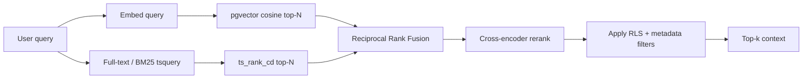
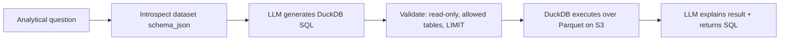

# 12 — RAG & Analytics Pipeline

Foundry has **two knowledge paths** that the chat agent unifies at query time:
1. **Unstructured semantic path** — chunks + embeddings in pgvector (PDF/DOCX/PPTX/MD/images/AV transcripts).
2. **Structured analytics path** — XLSX/CSV normalized to Parquet, queried by **DuckDB via agentic text-to-SQL**.

## Chunking (unstructured)
- **Structure-aware boundaries first:** headings/sections (DOCX/MD), slides (PPTX), pages (PDF),
  timestamped segments (audio/video). Never split across a natural boundary when avoidable.
- **Then token windows:** ~500–800 tokens per chunk, ~15% overlap, measured with the model tokenizer.
- **Metadata per chunk:** `document_version_id, ordinal, page|slide|ts_start_ms|ts_end_ms, section`,
  plus arbitrary `metadata` jsonb. This metadata powers citations and filters.

## Embeddings
- Model: **OpenAI `text-embedding-3-small`**, **1536 dims**, cosine distance.
- Stored in `embeddings.vector vector(1536)`; `embedding_model` + `dim` persisted for re-index.
- Batched embedding calls; repeat query-embeddings cached in Redis.
- HNSW index (`m=16, ef_construction=64`); `ef_search` tuned per query for recall/latency.
- **Re-indexing:** a CLI `reindex` re-embeds a project/org when the model or chunking changes,
  writing new vectors and flipping `is_active` atomically per version.

## Retrieval (hybrid)

- **Vector:** cosine top-N from pgvector, filtered by `organization_id`, `project_id`, active version.
- **Keyword/BM25:** Postgres full-text (`content_tsv`, `ts_rank_cd`) for lexical recall.
- **Fusion:** Reciprocal Rank Fusion combines the two ranked lists.
- **Rerank:** self-hosted cross-encoder reranks fused candidates; take top-k (default 8–12).
- **Filters:** RLS guarantees tenant isolation; metadata filters (tags/folder/doc/version) applied
  in the SQL `WHERE` so permissions and scope are enforced in the database, not post-hoc.

## Structured analytics (DuckDB text-to-SQL)

- Each XLSX sheet → a `tabular_datasets` row with `parquet_s3_key` + `schema_json`.
- The agent introspects `schema_json`, generates **DuckDB SQL**, which is **validated** (read-only;
  only whitelisted dataset tables; enforced row `LIMIT`) before execution.
- DuckDB reads Parquet directly from object storage (httpfs); results returned as rows.
- Answer includes the figures, a natural-language explanation, and the **SQL used** (cited).
- Guardrails: no DDL/DML, statement timeout, max rows, per-dataset access checked against RLS.

## Agentic chat orchestration
The chat is an agent (OpenAI Responses API, streaming, tool-calling) with tools:
- `router(question)` → decides semantic vs analytical vs hybrid.
- `vector_retrieve(query, filters)` → hybrid retrieval above.
- `sql_query(question, dataset_ids)` → DuckDB text-to-SQL above.

Loop: route → call tool(s) → assemble grounded context → generate answer (streamed) → attach
citations. Semantic and analytical results can be combined in one answer.

## Prompt design & grounding
- System prompt establishes an **instruction hierarchy**: system > developer > user; retrieved
  content is **data, not instructions**.
- Context is delimited and labeled with source ids; the model must cite the source id for each claim.
- **Insufficient-context rule:** if retrieved context doesn't support an answer, say so; do not guess.
- Answers must map every citation to an actually-retrieved chunk/dataset (validated post-generation).

## Prompt-injection defenses
- Retrieved text wrapped in explicit delimiters; a preprocessing step strips/neutralizes
  injection patterns ("ignore previous instructions", tool-call lookalikes) before they reach the model.
- The generation model has no direct tool authority derived from document content; tools are only
  invoked by the agent controller, never by instructions embedded in documents.
- Output constraints: no execution of instructions found in context; SQL is generated only from
  the user's analytical intent, never from document contents.

## Conversation memory
- Recent N turns kept verbatim; older turns compressed into `conversations.summary` (rolling
  summarization) to stay within the context window while preserving continuity.
- Each turn re-retrieves fresh context (memory ≠ retrieval).

## Evaluation (LangSmith + RAGAS-style)
- **Tracing:** every retrieval + generation traced in LangSmith (latency, tokens, tool calls).
- **Golden set:** curated Q/A + expected sources in `backend/src/foundry/evals/`.
- **Metrics:** faithfulness, answer relevance, context precision/recall (RAGAS-style), plus SQL
  exact-result checks for tabular questions.
- **CI gate:** eval runner fails the build if metrics fall below thresholds
  (faithfulness ≥ 0.85, context recall ≥ 0.80 — see [01 PRD](./01-prd.md)).
