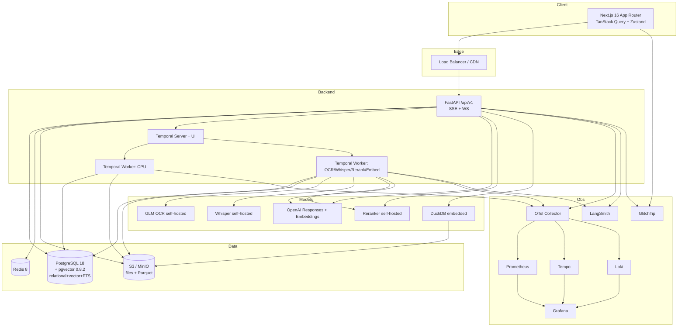
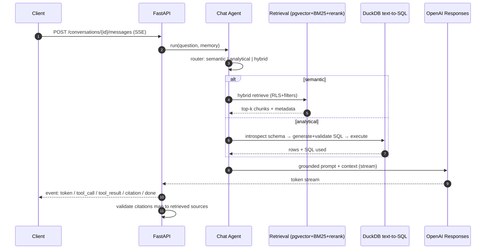
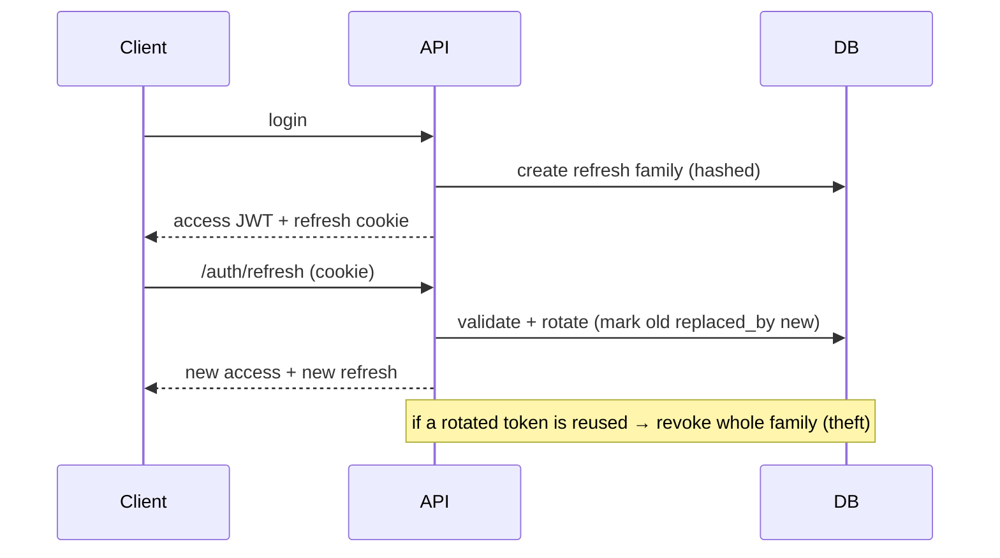
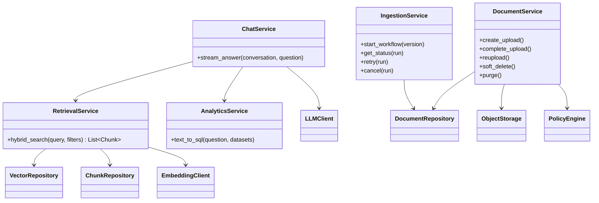
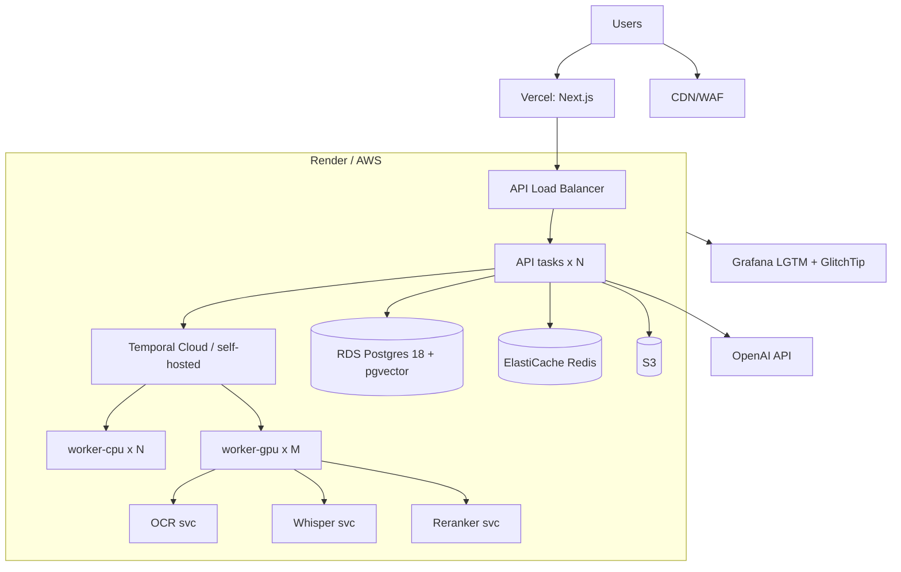

# 17 — Diagrams

All diagrams are Mermaid so they render in GitHub/most viewers and are agent-readable.

## System context / component diagram


## ER diagram
See [07 — Database Schema](./07-database-schema.md) for the full ER diagram and DDL.

## Ingestion sequence (durable)
```mermaid
sequenceDiagram
  autonumber
  participant C as Client
  participant API as FastAPI
  participant S3 as S3/MinIO
  participant T as Temporal
  participant W as Worker
  participant DB as Postgres(+pgvector)
  C->>API: POST /uploads (filename,size,mime)
  API-->>C: presigned multipart URLs
  C->>S3: upload parts (direct)
  C->>API: POST /uploads/{id}/complete (etags, content_hash)
  API->>DB: dedup check + create document_version
  API->>T: start <Kind>IngestWorkflow(version_id)
  API-->>C: {document_id, ingestion_run_id}
  loop each stage
    T->>W: schedule activity (retry policy + heartbeat)
    W->>DB: update_stage_status + publish event
    W-->>C: SSE/WS live update
  end
  W->>S3: read object / write parquet
  W->>DB: persist chunks + embeddings (idempotent)
  W->>DB: index_finalize (status=indexed)
  Note over W,DB: on terminal failure → dead_letters (DLQ); retry resumes from last good stage
```

## Chat (agentic RAG) sequence


## Auth token rotation


## Class diagram (backend core, simplified)


## Deployment / infrastructure (prod)

