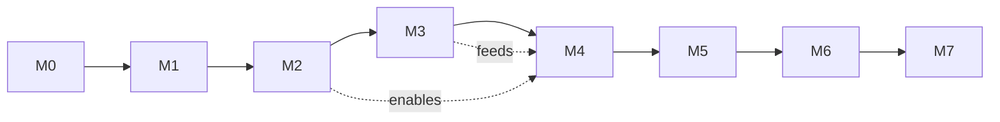

# 20 — Roadmap & Milestones

Granularity: **milestones → epics** (per your preference). Each milestone is independently
demoable. Epics reference functional requirements in [03](./03-functional-requirements.md). An
implementing agent should execute milestones in order; within a milestone, epics can parallelize
where dependencies allow.

## M0 — Foundations & scaffolding
*Goal: the whole platform boots via `docker compose up` with health checks, empty but wired.*
- **E0.1 Repo & tooling** — monorepo layout, backend/frontend scaffolds, lint/format/type-check, pre-commit, CI skeleton.
- **E0.2 Docker Compose base** — Postgres 18 + pgvector, Redis 8, Temporal + UI, MinIO, mailpit, OTel/LGTM, GlitchTip; healthchecks + `.env.sample`. (→ [14](./14-deployment-and-infrastructure.md))
- **E0.3 Config & observability baseline** — pydantic-settings, structured logging, OTel wiring, `/health` `/ready`.
- **E0.4 DB baseline** — Alembic, base migration, RLS scaffolding, seed CLI. (→ [07](./07-database-schema.md))

## M1 — Identity, tenancy & access
*Goal: invite → verify → login → RBAC/ABAC-gated multi-tenant app with strict isolation.*
- **E1.1 Auth core** — signup(org+owner), Argon2id, JWT access + rotating refresh + theft detection. (FR-AUTH-1..7)
- **E1.2 Email flows** — Resend/SES adapter (mailpit dev), verification, password reset, invitations. (FR-AUTH-1,2,5)
- **E1.3 RLS + ABAC** — RLS policies on all tenant tables, Casbin policy engine, deny-by-default. (FR-AUTHZ-*)
- **E1.4 Org/workspace/project CRUD + members/roles.** (FR-ORG-1,2; FR-AUTHZ-3)
- **E1.5 Cross-tenant isolation tests.** (NFR-SEC-5)

## M2 — Documents & upload
*Goal: upload large files directly to storage, with dedup + versioning + management UI.*
- **E2.1 Presigned multipart upload** (≤500MB, direct-to-S3), complete/abort. (FR-ING-1)
- **E2.2 Dedup + versioning** (content hash, version chain, retire vectors). (FR-ING-2,3)
- **E2.3 Documents/folders/tags CRUD**, soft-delete/trash/restore/purge, archival. (FR-ORG-3,4,5,6)
- **E2.4 File validation + ClamAV scan.** (FR-ING-4,5; NFR-SEC-7)
- **E2.5 Frontend: upload UI + documents table + trash.** (→ [09](./09-frontend-architecture.md))

## M3 — Ingestion pipeline (Temporal)
*Goal: durable, observable, resumable multimodal ingestion end-to-end.*
- **E3.1 Temporal setup + workers + task queues + dispatcher.** (FR-ING-6)
- **E3.2 Common activities** (validate, scan, persist, embed, index-finalize, status/publish).
- **E3.3 Unstructured workflows** — PDF/DOCX/PPTX (native + GLM OCR + vision fallback), Markdown, Image. (FR-ING-7,10,11,12)
- **E3.4 AV workflows** — Audio (Whisper), Video (ffmpeg→Whisper). (FR-ING-8)
- **E3.5 Structured workflow** — XLSX/CSV → Parquet + tabular dataset registration. (FR-ING-9)
- **E3.6 Reliability** — retry/backoff, DLQ, partial resume, cancel/pause/resume signals, heartbeats. (FR-ING-14,15,16)
- **E3.7 Live status** — DB status + Redis pub/sub → SSE/WS; frontend progress cards. (FR-ING-13)

## M4 — Retrieval & knowledge stores
*Goal: high-quality hybrid retrieval and validated tabular querying.*
- **E4.1 Chunking (structure-aware + overlap + metadata).** (FR-ING-11)
- **E4.2 Embeddings + pgvector HNSW + re-index CLI.** (FR-ING-12)
- **E4.3 Hybrid retrieval** — vector + BM25 + RRF + cross-encoder rerank + RLS/metadata filters. (FR-CHAT-4)
- **E4.4 DuckDB text-to-SQL** — schema introspection, SQL generation + validation + execution. (FR-CHAT-5)
- **E4.5 (Optional) Batch ingestion workflow** for bulk uploads.

## M5 — Agentic chat
*Goal: streaming, grounded, tool-using chat with citations and memory.*
- **E5.1 Conversations/messages + persisted threads.** (FR-CHAT-1)
- **E5.2 Agent loop + tools** (router, vector_retrieve, sql_query), streaming SSE. (FR-CHAT-2,3)
- **E5.3 Grounded prompting** + inline citations + source deep-links + insufficient-context fallback. (FR-CHAT-6,7)
- **E5.4 Memory** — sliding window + rolling summary. (FR-CHAT-8)
- **E5.5 Prompt-injection defenses.** (FR-CHAT-9; NFR-SEC-8)
- **E5.6 Frontend chat** — streaming renderer, tool-step panel, sources, tabular results/charts.

## M6 — Admin, observability & evaluation
*Goal: operable, measurable, auditable platform.*
- **E6.1 Super-admin console** (orgs, usage, impersonation-audited). (FR-ADM-1)
- **E6.2 Org usage analytics** (docs/storage/tokens/queries). (FR-ADM-2)
- **E6.3 Audit logging** across security-relevant actions. (FR-ADM-3; NFR-SEC-9)
- **E6.4 Full observability** — Grafana dashboards (pipeline/failure/AI), alerts, LangSmith tracing. (FR-ADM-4)
- **E6.5 AI eval harness** — RAGAS-style golden set + CI gate. (FR-ADM-5)

## M7 — Hardening & delivery
*Goal: production-ready, tested, deployable.*
- **E7.1 Cross-cutting API** — idempotency, cursor pagination/filter/sort, Redis caching, rate limiting. (FR-API-*)
- **E7.2 Test suites** — unit/integration/workflow-replay/e2e/load; coverage targets. (→ [16](./16-testing-strategy.md))
- **E7.3 Security pass** — headers, secrets, dependency/image scans, download signing.
- **E7.4 CI/CD deploy** — Vercel (frontend) + Render/AWS (backend), migrations as release step, smoke tests. (→ [14](./14-deployment-and-infrastructure.md))
- **E7.5 Docs & DX** — README, OpenAPI/Swagger, seed/mock data, runbooks, architecture docs.

## Suggested dependency order

## Definition of Done (per milestone)
Code + tests pass in CI; migrations included; feature demoable via compose with seed data;
observability wired for new surfaces; docs updated.
